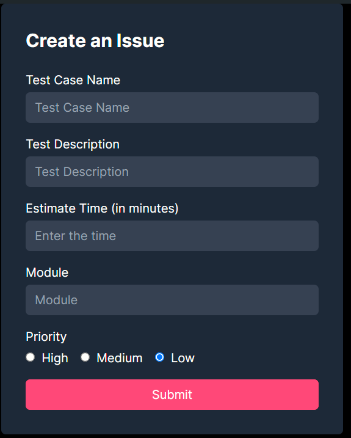

# Issue Tracker Application




This project is an Issue Tracker Application built with Next.js and Tailwind CSS. It allows users to create, view, and update issues, complete with authentication and authorization via NextAuth.

## Features

- User authentication with NextAuth
- Create new issues
- View a list of all issues
- Update issue status
- Responsive design with Tailwind CSS

## Technologies Used

- Next.js
- React
- Tailwind CSS
- NextAuth for authentication
- Prisma for database ORM
- Axios for API requests

## Getting Started

### Prerequisites

Ensure you have the following installed on your machine:

- Node.js (>=14.x)
- npm or yarn
- A PostgreSQL database (or another Prisma-supported database)

### Installation

1. Clone the repository:

   ```sh
   git clone https://github.com/yourusername/issue-tracker.git
   cd issue-tracker
   ```

2. Install dependencies:

   ```sh
   npm install
   # or
   yarn install
   ```

3. Set up your environment variables:

   Create a `.env.local` file in the root directory and add the following variables:

   ```env
   DATABASE_URL="your-database-url"
   NEXTAUTH_URL=http://localhost:3000
   NEXTAUTH_SECRET=your-nextauth-secret
   GOOGLE_ID=your-google-id
   GOOGLE_SECRET=your-google-secret
   ```

4. Set up the database:

   ```sh
   npx prisma migrate dev --name init
   ```

5. Start the development server:

   ```sh
   npm run dev
   # or
   yarn dev
   ```

   Your application should now be running on [http://localhost:3000](http://localhost:3000).

### Usage

#### Creating an Issue

1. Navigate to the "Create Issue" page.
2. Fill out the form with the necessary details (Test Case Name, Test Description, Estimated Time, Module, Priority).
3. Click the "Submit" button to create the issue.

#### Viewing Issues

1. Navigate to the "Issues" page.
2. View the list of all issues with their details.

#### Updating Issue Status

1. On the "Issues" page, select a status (PASS/FAIL) from the dropdown for the desired issue.
2. The status will be updated in the database.

## API Routes

- **GET** `/api/getIssues`: Fetches all issues from the database.
- **POST** `/api/createIssue`: Creates a new issue in the database.
- **PUT** `/api/updateIssueStatus`: Updates the status of an existing issue.

## Code Overview

### Components

- `CreateIssue`: Component for creating a new issue.
- `IssueList`: Component for listing all issues.
- `IssueItem`: Component for individual issue item.

### Pages

- `index.tsx`: Home page.
- `Issuecreation.tsx`: Page for creating an issue.
- `Issues.tsx`: Page for viewing all issues.

### Styles

Tailwind CSS is used for styling components.

### Authentication

NextAuth is used for authentication. Users can sign in with their Google accounts.

## Contributing

1. Fork the repository.
2. Create a new branch: `git checkout -b my-feature-branch`
3. Make your changes and commit them: `git commit -m 'Add some feature'`
4. Push to the branch: `git push origin my-feature-branch`
5. Submit a pull request.

## License

This project is licensed under the MIT License.

## Acknowledgements

- [Next.js](https://nextjs.org/)
- [Tailwind CSS](https://tailwindcss.com/)
- [NextAuth.js](https://next-auth.js.org/)
- [Prisma](https://www.prisma.io/)
- [Axios](https://axios-http.com/)
